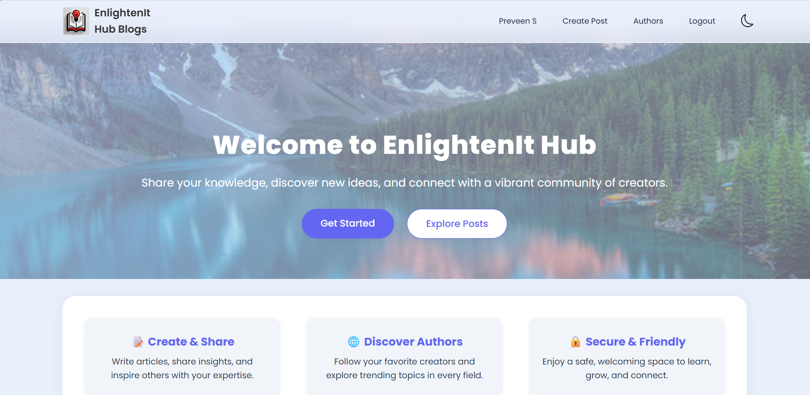
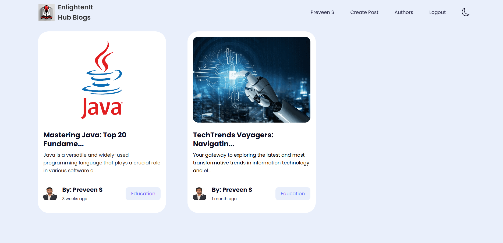

# 🌟 EnlightenIt-Hub-App - MERN Blogging Platform


The **EnlightenIt-Hub-App** is a full-stack MERN (MongoDB, Express.js, React, Node.js) blogging platform that enables users to create, share, and explore content across diverse topics. It features a modern UI, responsive design, and secure JWT-based authentication. Users can register, manage profiles, follow authors, and interact with posts through a personalized dashboard. Media uploads are handled via Cloudinary, and data is stored in MongoDB. The React frontend (deployed on Render) communicates with a Node.js/Express backend via RESTful APIs, with CORS support for cross-origin access—creating a scalable and engaging space for knowledge sharing.

🔗 **Related Documentations**: [Client README](./client/README.md) | [Server README](./server/README.md) 

🔗 **Live Project**: <https://enlightenit-hub-app.onrender.com/>

---

<table style="width: 100%; max-width: 800px; margin: 30px auto; border-collapse: separate; border-spacing: 0; font-family: 'Segoe UI', Arial, sans-serif; box-shadow: 0 10px 30px rgba(0,0,0,0.08); border-radius: 16px; overflow: hidden;">
  <thead>
    <tr>
      <th colspan="2" style="background: linear-gradient(135deg, #667eea 0%, #764ba2 100%); color: white; padding: 20px 25px; font-size: 22px; text-align: center; font-weight: 600; letter-spacing: 0.5px;">
        📋 Table of Contents
      </th>
    </tr>
  </thead>
  <tbody>
    <tr style="background: #f8f9fa;">
      <td style="padding: 16px 25px; border-bottom: 1px solid #eee; width: 50px; text-align: center; font-weight: bold; color: #667eea; font-size: 18px;">01</td>
      <td style="padding: 16px 25px; border-bottom: 1px solid #eee;"><a href="#platform-description" style="text-decoration: none; color: #2c3e50; font-size: 17px; font-weight: 500;">Platform Description</a></td>
    </tr>
    <tr>
      <td style="padding: 16px 25px; border-bottom: 1px solid #eee; width: 50px; text-align: center; font-weight: bold; color: #667eea; font-size: 18px;">02</td>
      <td style="padding: 16px 25px; border-bottom: 1px solid #eee;"><a href="#core-features" style="text-decoration: none; color: #2c3e50; font-size: 17px; font-weight: 500;">🚀 Core Features</a></td>
    </tr>
    <tr style="background: #f8f9fa;">
      <td style="padding: 16px 25px; border-bottom: 1px solid #eee; width: 50px; text-align: center; font-weight: bold; color: #667eea; font-size: 18px;">03</td>
      <td style="padding: 16px 25px; border-bottom: 1px solid #eee;"><a href="#screenshots" style="text-decoration: none; color: #2c3e50; font-size: 17px; font-weight: 500;">📸 Screenshots</a></td>
    </tr>
    <tr>
      <td style="padding: 16px 25px; border-bottom: 1px solid #eee; width: 50px; text-align: center; font-weight: bold; color: #667eea; font-size: 18px;">04</td>
      <td style="padding: 16px 25px; border-bottom: 1px solid #eee;"><a href="#project-demo" style="text-decoration: none; color: #2c3e50; font-size: 17px; font-weight: 500;">📽️ Project Demo</a></td>
    </tr>
    <tr style="background: #f8f9fa;">
      <td style="padding: 16px 25px; border-bottom: 1px solid #eee; width: 50px; text-align: center; font-weight: bold; color: #667eea; font-size: 18px;">05</td>
      <td style="padding: 16px 25px; border-bottom: 1px solid #eee;"><a href="#tech-stack" style="text-decoration: none; color: #2c3e50; font-size: 17px; font-weight: 500;">🛠️ Tech Stack</a></td>
    </tr>
    <tr>
      <td style="padding: 16px 25px; border-bottom: 1px solid #eee; width: 50px; text-align: center; font-weight: bold; color: #667eea; font-size: 18px;">06</td>
      <td style="padding: 16px 25px; border-bottom: 1px solid #eee;"><a href="#project-structure" style="text-decoration: none; color: #2c3e50; font-size: 17px; font-weight: 500;">📂 Project Structure</a></td>
    </tr>
    <tr style="background: #f8f9fa;">
      <td style="padding: 16px 25px; border-bottom: 1px solid #eee; width: 50px; text-align: center; font-weight: bold; color: #667eea; font-size: 18px;">07</td>
      <td style="padding: 16px 25px; border-bottom: 1px solid #eee;"><a href="#installation-setup" style="text-decoration: none; color: #2c3e50; font-size: 17px; font-weight: 500;">🧪 Installation & Setup</a></td>
    </tr>
    <tr>
      <td style="padding: 16px 25px; border-bottom: 1px solid #eee; width: 50px; text-align: center; font-weight: bold; color: #667eea; font-size: 18px;">08</td>
      <td style="padding: 16px 25px; border-bottom: 1px solid #eee;"><a href="#connecting-frontend-backend-mongodb" style="text-decoration: none; color: #2c3e50; font-size: 17px; font-weight: 500;">➡️ Connecting Frontend, Backend & MongoDB</a></td>
    </tr>
    <tr style="background: #f8f9fa;">
      <td style="padding: 16px 25px; border-bottom: 1px solid #eee; width: 50px; text-align: center; font-weight: bold; color: #667eea; font-size: 18px;">09</td>
      <td style="padding: 16px 25px; border-bottom: 1px solid #eee;"><a href="#contributing" style="text-decoration: none; color: #2c3e50; font-size: 17px; font-weight: 500;">🤝 Contributing</a></td>
    </tr>
    <tr>
      <td style="padding: 16px 25px; border-bottom: 1px solid #eee; width: 50px; text-align: center; font-weight: bold; color: #667eea; font-size: 18px;">10</td>
      <td style="padding: 16px 25px; border-bottom: 1px solid #eee;"><a href="#license" style="text-decoration: none; color: #2c3e50; font-size: 17px; font-weight: 500;">📄 License</a></td>
    </tr>
    <tr style="background: #f8f9fa;">
      <td style="padding: 16px 25px; border-bottom: 1px solid #eee; width: 50px; text-align: center; font-weight: bold; color: #667eea; font-size: 18px;">11</td>
      <td style="padding: 16px 25px; border-bottom: 1px solid #eee;"><a href="#contact" style="text-decoration: none; color: #2c3e50; font-size: 17px; font-weight: 500;">📧 Contact</a></td>
    </tr>
    <tr>
      <td style="padding: 16px 25px; border-bottom: 1px solid #eee; width: 50px; text-align: center; font-weight: bold; color: #667eea; font-size: 18px;">12</td>
      <td style="padding: 16px 25px;"><a href="#show-your-support" style="text-decoration: none; color: #2c3e50; font-size: 17px; font-weight: 500;">🌟 Show Your Support</a></td>
    </tr>
  </tbody>
</table>


---

## 🚀 Core Features

### 📝 Blogging Platform
- Create, share, and explore posts on various topics.
- Follow your favorite creators and discover trending topics.

### 🔒 Secure & Friendly
- Authentication using JSON Web Tokens (JWT) and Bcrypt.js.
- Safe and welcoming space for users to connect and grow.

### 🌐 Full-Stack Integration
- Frontend communicates with the backend via RESTful APIs.
- Backend handles CRUD operations with MongoDB.
- CORS configuration enables cross-origin requests from the frontend.

### 📱 Responsive Design
- Adapts to different screen sizes for a consistent experience.
- Ensures usability on both desktop and mobile devices.

### ☁️ File Storage Integration
- Integrated with Cloudinary for efficient and secure file storage.
- Supports uploading and managing images for posts and user profiles.

### 👤 Author Features
- View posts created by specific authors.
- Follow authors to stay updated on their latest posts.

### 🗂️ Category-Based Features
- Browse posts by categories to find content of interest.
- Filter posts based on topics like education, science, or entertainment.

### 📊 Dashboard
- Access a personalized dashboard to manage your posts.
- Edit or delete posts directly from the dashboard.

### 📄 Post Detail
- View detailed information about individual posts.
- See the author, category, and creation date of each post.

### 👥 User Profile
- Manage your profile information, including name and avatar.
- Update your profile details and preferences.

---

## 📸 Screenshots

Below are some screenshots showcasing the **EnlightenIt-Hub-App** interface:





---

## 📽️ Project Demo

Below is the project demo video of the **EnlightenIt-Hub-App** interface:

[Project Demo Video](https://jmp.sh/2Mff88WX)

---

## 🛠️ Tech Stack
- **Frontend**: React, CSS ([Client README](./client/README.md))
- **Backend**: Node.js, Express.js ([Server README](./server/README.md))
- **Database**: MongoDB
- **Authentication**: JSON Web Tokens (JWT)
- **File Storage**: Cloudinary

---

## 📂 Project Structure
```plaintext
enlightenit-hub-app/
    ├── client/                # Frontend React application (see Client README)
    ├── server/                # Backend Node.js/Express application (see Server README)
    ├── .gitignore             # Git ignore file
    ├── package.json           # Backend dependencies
    ├── package-lock.json      # Backend dependency lock file
    ├── LICENSE                # MIT License file
    └── README.md              # Main project documentation
```

---

## 🧪 Installation & Setup
### 📋 Prerequisites
- Node.js (v14 or higher)
- npm or yarn
- MongoDB (local installation or MongoDB Atlas)
- A Cloudinary Account (for cloud media storage)
- Postman API (for API endpoints testing)

### 🧑‍💻 Steps to Run
1. **Clone the repository**
   ```bash
   git clone https://github.com/your-username/EnlightenIt-Hub-App.git
   cd EnlightenIt-Hub-App
   ```

2. **Set up the backend**
   - Follow the instructions in the [Server README](./server/README.md) to configure and run the backend.

3. **Set up the frontend**
   - Follow the instructions in the [Client README](./client/README.md) to configure and run the frontend.

4. **Deployment on Render**
   - **Frontend**: See deployment instructions in the [Client README](./client/README.md).
   - **Backend**: See deployment instructions in the [Server README](./server/README.md).
   - Access the live app at: <https://enlightenit-hub-app.onrender.com/>

---

## ➡️ Connecting Frontend, Backend, and MongoDB
For detailed instructions on connecting the frontend, backend, and MongoDB, refer to the [Server README](./server/README.md) and [Client README](./client/README.md) for specific configurations.

---

## 🤝 Contributing
Pull requests are welcome! Feel free to fork the repository and suggest improvements.

Steps to contribute:
```bash
# 1. Fork the repository
# 2. Create a feature branch
git checkout -b feature-name
# 3. Commit your changes
git commit -m "Add feature description"
# 4. Push to GitHub
git push origin feature-name
# 5. Open a Pull Request
```
---

## 📄 License

This project is licensed under the MIT License - see the [LICENSE](LICENSE) file for details.

---

## 📧 Contact
For queries or suggestions:
- 📩 Email: [spreveen123@gmail.com](mailto:spreveen123@gmail.com)
- 🌐 LinkedIn: [www.linkedin.com/in/preveen-s/](https://www.linkedin.com/in/preveen-s/)

---

## 🌟 Show Your Support
If you like this project, please consider giving it a ⭐ on GitHub!
